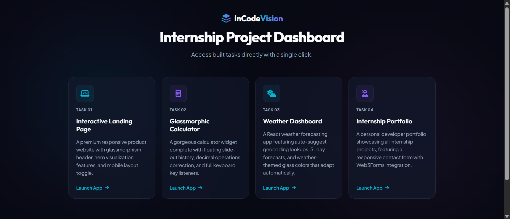
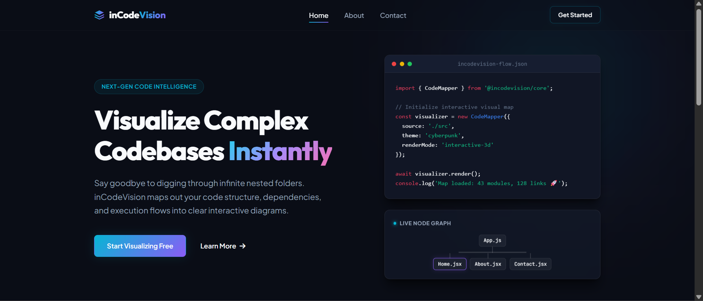
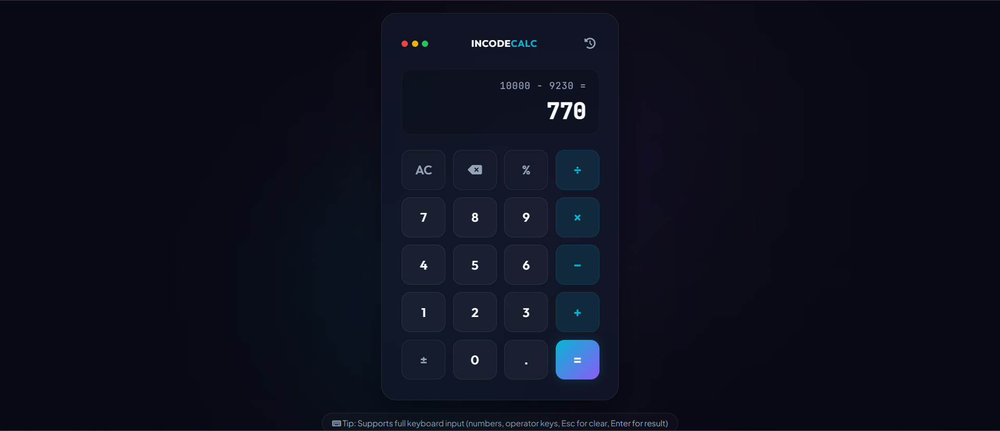
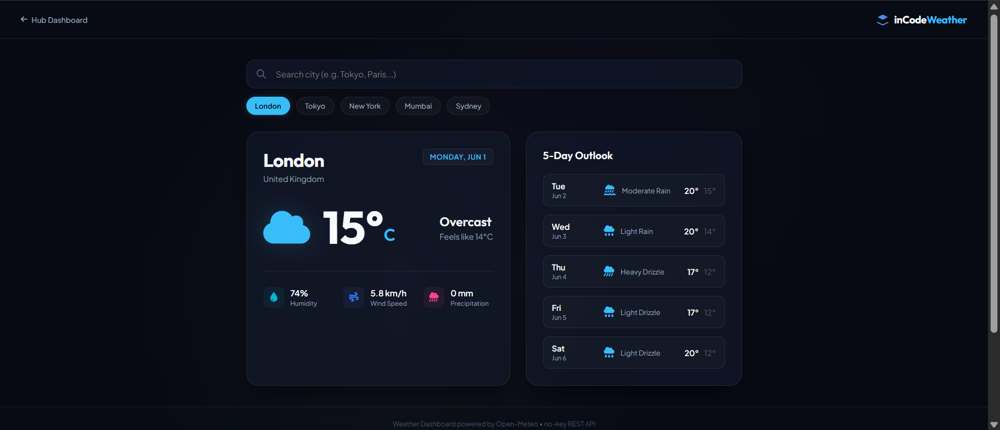
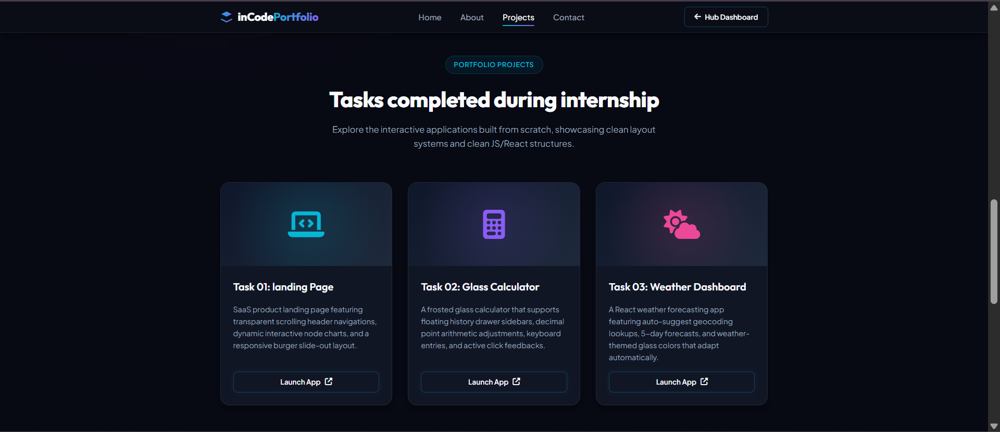

# inCodeVision Internship Project Dashboard 🚀

Welcome to my **inCodeVision Frontend Development Internship** repository! This project hosts a collection of 4 premium interactive web applications built from scratch, unified under a single entry dashboard.

## 📸 Project Previews

Here is a visual overview of the dashboard and applications:

### Main Dashboard Portal
<!-- PLACE YOUR DASHBOARD SCREENSHOT HERE -->
<!-- Save your screenshot as "dashboard_preview.png" inside a folder named "screenshots" at the root -->


---

## 📂 Project Showcase

### 1. [Task 01: Premium Landing Page](./Task-01-Landing-Page/index.html)
A modern SaaS product landing page styled with high-end glassmorphism and smooth responsive visuals.
- **Tech Stack**: HTML5, CSS3, JavaScript
- **Screenshot**:
  <!-- Save as "task1_preview.png" in "screenshots" folder -->
  
- **Key Features**:
  - Glassmorphic navigation header that shifts opacity and height on scroll.
  - Interactive code terminal mockup with a floating live node dependency tree.
  - Symmetrical cards grid featuring border glow shifts on mouse hover.
  - Mobile hamburger toggle with full layout adaptivity.

### 2. [Task 02: Glassmorphic Calculator](./Task-02-Calculator/index.html)
A sleek, premium calculator widget with real-time operations history tracking.
- **Tech Stack**: HTML5, CSS3, JavaScript
- **Screenshot**:
  <!-- Save as "task2_preview.png" in "screenshots" folder -->
  
- **Key Features**:
  - Center grid calculator keypad with glassmorphic active-click scaling styles.
  - Floating slide-out history sidebar retrieving up to 30 past equations, persisted in `localStorage`.
  - Floating-point arithmetic rounding corrections (prevents precision errors).
  - Full keyboard event bindings support (numbers, operators, backspace, clear).

### 3. [Task 03: Weather Dashboard](./Task-03-Weather-App/dist/index.html)
A real-time weather forecasting application changing themes dynamically based on conditions.
- **Tech Stack**: React.js, Vite, Open-Meteo REST & Geocoding API
- **Screenshot**:
  <!-- Save as "task3_preview.png" in "screenshots" folder -->
  
- **Key Features**:
  - Geocoding city search text input with instant suggestion autocomplete.
  - 5-day weather outlook forecast with corresponding icons.
  - Dynamic backgrounds shifting colors and glow shapes based on current conditions (sunny, rainy, snowy, cloudy, thunderstorm).
  - Quick-selection city shortcut buttons.

### 4. [Task 04: Internship Portfolio](./Task-04-Portfolio/index.html)
A personal developer portfolio page showcasing all completed tasks.
- **Tech Stack**: HTML5, CSS3, JavaScript, Web3Forms API
- **Screenshot**:
  <!-- Save as "task4_preview.png" in "screenshots" folder -->
  
- **Key Features**:
  - Skills timeline capsules with glowing borders.
  - Asynchronous email contact form integrated with **Web3Forms** (direct inbox delivery).
  - Custom frosted success feedback modal overlay.

---

## 🛠️ How to Run Locally

1. **Clone the repository**:
   ```bash
   git clone https://github.com/YOUR_USERNAME/inCodeVision.git
   cd inCodeVision
   ```

2. **Run the static apps**:
   Double click the root [index.html](./index.html) file to open the dashboard, or open with a local web server (like VS Code Live Server).

3. **Run the React Weather App (Task 3)**:
   ```bash
   cd Task-03-Weather-App
   npm install
   npm run dev
   ```

---

## 🌐 Live Demo Deployments

This repository is configured to be hosted live on:
- **GitHub Pages**: Set build settings branch to `main` and folder to `/(root)`.
- **Vercel**: Detects the static root configuration automatically on import.
